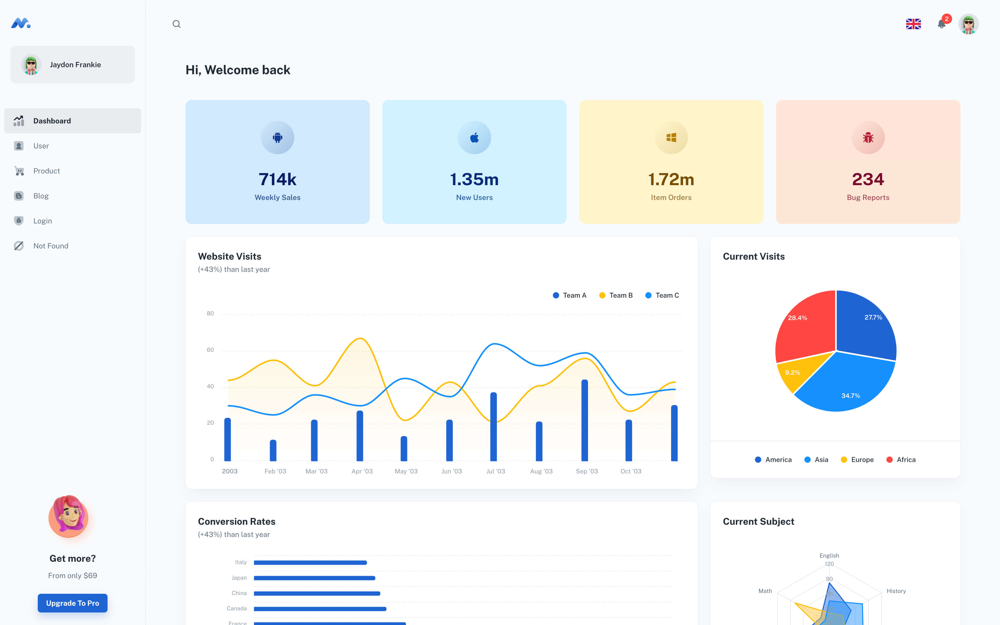

## Figs-CRM 

> CRM made from template components from MINIMALS.CC as well as custom components by Rafael Figueroa

## App demo

- [Figs-CRM](https://)

## Getting started

- Recommended `node js 16.x` and `npm 6+`. (suggestion v16.15.0)
- Install dependencies: `npm install` / `yarn install`
- Start the project: `npm run start` / `yarn start`

## License

Distributed under the MIT License. See [LICENSE](https://github.com/minimal-ui-kit/minimal.free/blob/main/LICENSE.md) for more information.

